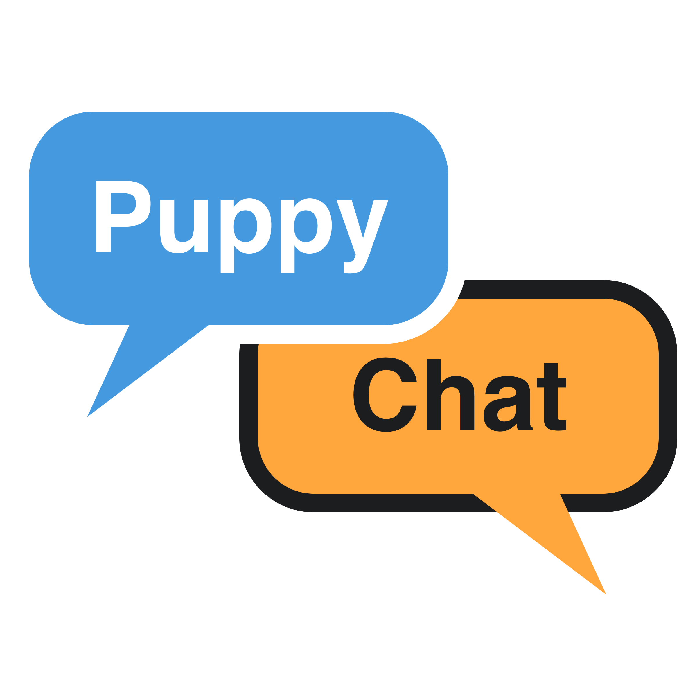
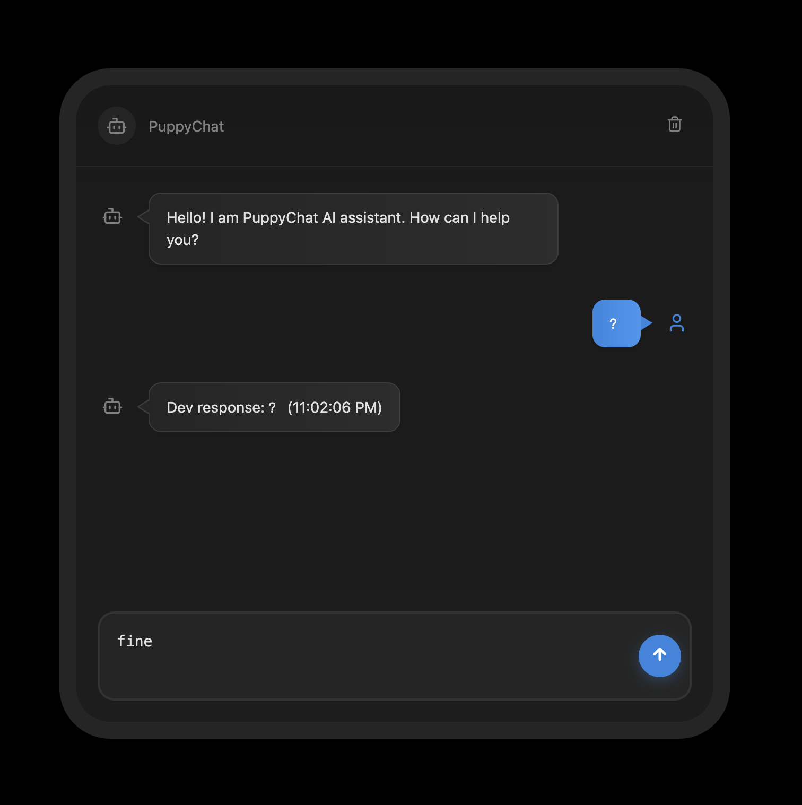
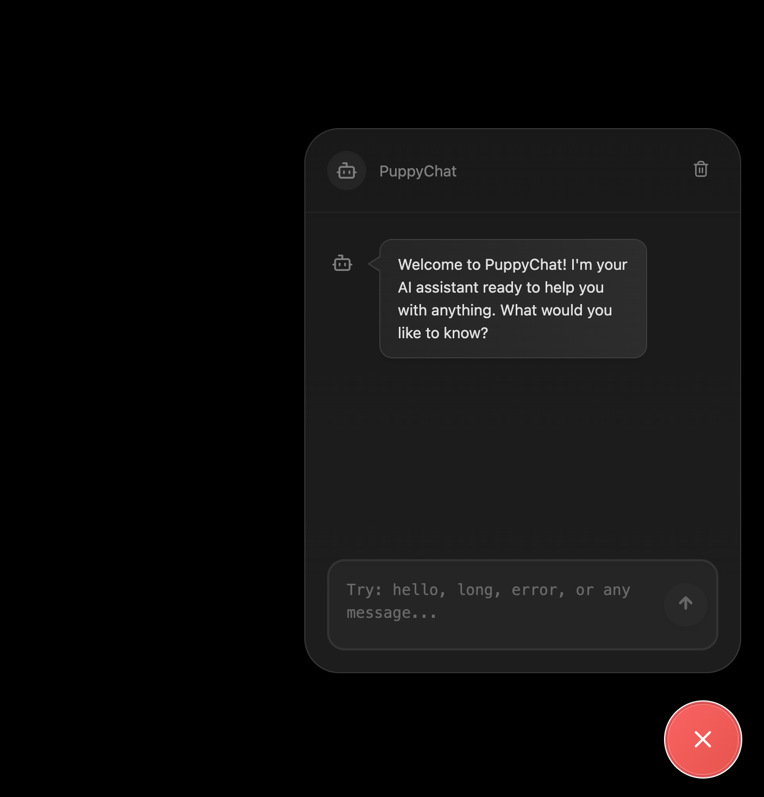

<div align="center">
      
    <h1 align="center">PuppyChat</h1>

**React SDK for building AI chatbot interfaces**

</div>

## Use Cases

- 💼 **Customer Support**: Build intelligent customer service chatbots for websites
- 🛒 **E-commerce Assistant**: Create shopping assistants to help users find products
- 🏢 **HR Assistant**: Create employee onboarding and FAQ chatbots
- 🎮 **Gaming NPCs**: Create interactive characters for games and virtual worlds
- 📱 **Mobile App Integration**: Add conversational AI to mobile applications
- 🌐 **Website Enhancement**: Improve user engagement with interactive chat features

## Installation

```bash
npm install puppychat-react-sdk
```

or

```bash
yarn add puppychat-react-sdk
```

## Components

PuppyChat provides two main components for different use cases:

### 1. ChatInterface - Full Chat Interface

A complete chat interface component for embedding directly in your application.

<div align="center">
  
</div>


```tsx
import React from 'react'
import { ChatInterface } from 'puppychat-react-sdk'

function App() {
  const handleSendMessage = async (message: string) => {
    // Your message handling logic here
    return `Echo: ${message}`
  }

  return (
    <div style={{ height: '100vh', padding: '20px' }}>
      <ChatInterface
        onSendMessage={handleSendMessage}
        title="My Chat Bot"
        welcomeMessage="Hello! How can I help you today?"
        width="600px"
        height="500px"
        placeholder="Type your message..."
      />
    </div>
  )
}

export default App
```

#### ChatInterface Props

| Prop | Type | Default | Description |
|------|------|---------|-------------|
| `onSendMessage` | `(message: string) => Promise<string> \| string` | - | Function to handle sending messages |
| `initialMessages` | `Message[]` | - | Initial messages to display |
| `placeholder` | `string` | `"Type your message..."` | Input placeholder text |
| `title` | `string` | `"PuppyChat"` | Chat interface title |
| `className` | `string` | `""` | Additional CSS class |
| `disabled` | `boolean` | `false` | Disable the chat interface |
| `width` | `string \| number` | `'80vw'` | Interface width |
| `height` | `string \| number` | `'800px'` | Interface height |
| `welcomeMessage` | `string` | `"Hello! I am PuppyChat AI assistant. How can I help you?"` | Initial welcome message |

### 2. ChatBubble - Floating Chat Widget

A floating chat bubble that can be positioned anywhere on your page, perfect for customer support widgets.

<div align="center">
  
</div>

```tsx
import React from 'react'
import { ChatBubble } from 'puppychat-react-sdk'

function App() {
  const handleSendMessage = async (message: string) => {
    // Your message handling logic here
    return `Echo: ${message}`
  }

  return (
    <div style={{ height: '100vh' }}>
      {/* Your page content */}
      <h1>Welcome to my website</h1>
      
      {/* Floating chat bubble */}
      <ChatBubble
        chatProps={{
          onSendMessage: handleSendMessage,
          title: "Support Chat",
          welcomeMessage: "Hi! How can we help you today?",
          width: '400px',
          height: '500px'
        }}
        bubbleProps={{
          size: 60,
          pulseAnimation: true
        }}
        position="bottom-right"
        enableOverlay={true}
        overlayOpacity={0.3}
        animationDuration={300}
      />
    </div>
  )
}

export default App
```

#### ChatBubble Props

| Prop | Type | Default | Description |
|------|------|---------|-------------|
| `chatProps` | `Omit<ChatInterfaceProps, 'className'>` | `{}` | Props for the chat interface |
| `bubbleProps` | `Omit<FloatingBubbleProps, 'onClick' \| 'isOpen'>` | `{}` | Props for the floating bubble |
| `defaultOpen` | `boolean` | `false` | Whether chat starts open |
| `animationDuration` | `number` | `300` | Animation duration in ms |
| `overlayOpacity` | `number` | `0.3` | Background overlay opacity |
| `enableOverlay` | `boolean` | `true` | Show background overlay when open |
| `onStateChange` | `(isOpen: boolean) => void` | - | Callback when chat opens/closes |
| `position` | `'bottom-right' \| 'bottom-left' \| 'top-right' \| 'top-left'` | `'bottom-right'` | Bubble position |
| `chatOffset` | `{ x: number; y: number }` | `{ x: 0, y: 0 }` | Chat position offset |

#### FloatingBubble Props (for bubbleProps)

| Prop | Type | Default | Description |
|------|------|---------|-------------|
| `size` | `number` | `60` | Bubble size in pixels |
| `pulseAnimation` | `boolean` | `true` | Enable pulse animation |
| `className` | `string` | `""` | Additional CSS class |

### Preview

## Development

### Running the Development Server

```bash
npm run dev
```

### Building the SDK

```bash
npm run build:sdk
```

### Testing

The project includes a development test page at `/` where you can test the component with various scenarios:

- Normal messages
- Long messages (test with "long")
- Error handling (test with "error")
- Greeting responses (test with "hello")

## License

This project is licensed under the MIT License - see the [LICENSE](LICENSE) file for details.

## Changelog

### v0.1.0
- Initial release
- Basic chat interface functionality
- TypeScript support
- Customizable welcome messages
- Dark theme design
- Responsive layout
- Floating chat bubble widget
- Multiple positioning options
- Overlay and animation support 