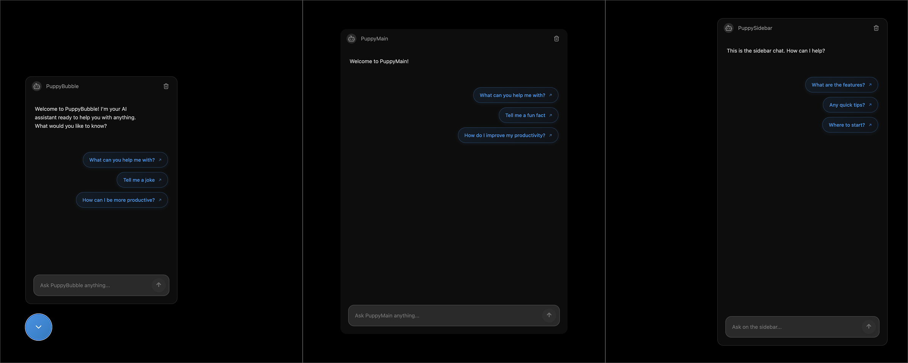

<p align="center">
  
</p>

<h1 align="center">PuppyChat</h1>

<p align="center">
  <a href="https://www.puppyagent.com" target="_blank">
    
  </a>
  &nbsp;
  <a href="https://x.com/PuppyAgentTech" target="_blank">
    
  </a>
  &nbsp;
  <a href="https://discord.gg/puppychat" target="_blank">
    
  </a>
  &nbsp;
  <a href="mailto:support@puppyagent.com">
    
  </a>
</p>

<p align="center">React SDK for building AI chatbot interfaces</p>

PuppyChat is a React SDK designed for developers and product teams who need to quickly integrate AI chat capabilities into their applications. 

It provides three distinct styles - **ChatBubble**, **ChatSidebar**, and **ChatMain** - each optimized for different use cases:

- **Chat in Bubble** - Ideal for customer support widgets and non-intrusive help assistants
- **Chat in Sidebar** - Perfect for documentation sites and persistent co-pilot experiences  
- **Chat in Main** - Best for full-featured chatbot applications and internal knowledge base portals


<div align="center">
  
</div>

## Installation

```bash
npm i puppychat
```

or

```bash
yarn add puppychat
```

## Usage

PuppyChat provides three main components for different use cases:

### 1. ChatMain - Full-Page Chat Interface

A complete full-page chat interface for building dedicated chat applications.

```tsx
import React from 'react'
import { ChatMain } from 'puppychat'

function App() {
  const handleSendMessage = async (message: string) => {
    // Your message handling logic here
    return `Echo: ${message}`
  }

  return (
    <div style={{ height: '100vh', display: 'flex', alignItems: 'center', justifyContent: 'center' }}>
      <ChatMain
        onSendMessage={handleSendMessage}
        title="PuppyMain"
        placeholder="Ask PuppyMain anything..."
        welcomeMessage="Welcome to PuppyMain!"
        width="600px"
        height="90%"
        recommendedQuestions={[
          "What can you help me with?",
          "Tell me a fun fact",
          "How do I improve my productivity?",
        ]}
        showHeader={true}
        backgroundColor="#0D0D0D"
        borderWidth={3}
        showAvatar={false}
      />
    </div>
  )
}

export default App
```

### 2. ChatBubble - Floating Chat Widget

A floating chat bubble that can be positioned anywhere on your page, perfect for customer support widgets.

```tsx
import React from 'react'
import { ChatBubble } from 'puppychat'

function App() {
  const handleSendMessage = async (message: string) => {
    // Your message handling logic here
    return `Echo: ${message}`
  }

  return (
    <div style={{ height: '100vh' }}>
      {/* Your page content */}
      <h1>Welcome to my website</h1>
      
      {/* Floating chat bubble */}
      <ChatBubble
        chatProps={{
          onSendMessage: handleSendMessage,
          title: "PuppyBubble",
          placeholder: "Ask PuppyBubble anything...",
          welcomeMessage: "Welcome to PuppyBubble! I'm your AI assistant ready to help you with anything. What would you like to know?",
          width: '400px',
          height: '600px',
          recommendedQuestions: [
            "What can you help me with?",
            "Tell me a joke",
            "How can I be more productive?",
          ]
        }}
        bubbleProps={{
          size: 64,
          pulseAnimation: true
        }}
        position="bottom-left"
        enableOverlay={true}
        overlayOpacity={0.3}
        animationDuration={300}
      />
    </div>
  )
}

export default App
```

### 3. ChatSidebar - Sidebar Chat Panel

A fixed sidebar chat panel that stays anchored to the side of your page, ideal for documentation sites and persistent assistants.

```tsx
import React from 'react'
import { ChatSidebar } from 'puppychat'

function App() {
  const handleSendMessage = async (message: string) => {
    // Your message handling logic here
    return `Echo: ${message}`
  }

  return (
    <div style={{ height: '100vh', position: 'relative' }}>
      {/* Your page content */}
      <main>
        <h1>My Documentation Site</h1>
        <p>Content goes here...</p>
      </main>
      
      {/* Sidebar chat */}
      <ChatSidebar
        width={480}
        position="right"
        topOffset={0}
        bottomOffset={0}
        showHeader={true}
        title="PuppySidebar"
        placeholder="Ask on the sidebar..."
        welcomeMessage="This is the sidebar chat. How can I help?"
        recommendedQuestions={[
          "What are the features?",
          "Any quick tips?",
          "Where to start?",
        ]}
        onSendMessage={handleSendMessage}
      />
    </div>
  )
}

export default App
```

## License

This project is licensed under the MIT License - see the [LICENSE](LICENSE) file for details.
