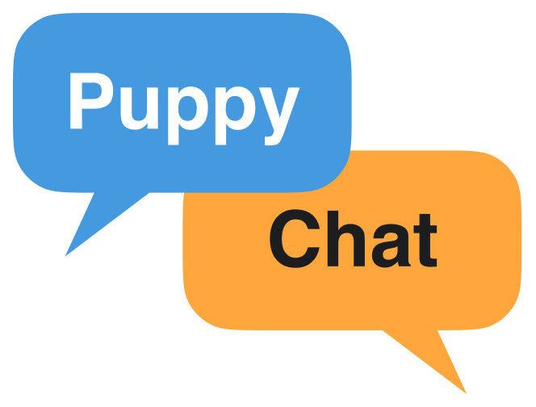

<p align="center">
  
</p>

<h1 align="center">PuppyChat SDK</h1>

<p align="center">
  <a href="https://www.puppyagent.com" target="_blank">
    
  </a>
  &nbsp;
  <a href="https://x.com/PuppyAgentTech" target="_blank">
    
  </a>
  &nbsp;
  <a href="https://discord.gg/eRjwqZpjBT" target="_blank">
    
  </a>
  &nbsp;
  <a href="mailto:guantum@puppyagent.com">
    
  </a>
</p>

<p align="center">AI chatbot interfaces SDK in React</p>

PuppyChat is a React SDK designed for developers and product teams who need to quickly integrate AI chat capabilities into their applications. 

It provides three distinct styles - **ChatBubble**, **ChatSidebar**, and **ChatMain** - each optimized for different use cases:

- **Chat in Bubble** - Ideal for customer support widgets and non-intrusive help assistants
- **Chat in Sidebar** - Perfect for documentation sites and persistent co-pilot experiences  
- **Chat in Main** - Best for full-featured chatbot applications and internal knowledge base portals


<div align="center">
  
</div>

## What's New

### 🎉 v0.0.11 - October 4, 2025

- **Custom Header Icon**: You can now customize and replace the header logo with your own brand icon
- Added `headerIcon` prop - accepts both URL strings and React components
- Added `headerIconSize` prop - control the size of your custom icon
- Added `showHeaderIcon` prop - toggle icon visibility

See the [Configuration Reference](#configuration-reference) below for detailed usage examples.

## Installation

```bash
npm i puppychat
```

or

```bash
yarn add puppychat
```


## Usage


### AI Coding Assistant Guide

For developers using AI coding assistants like **Cursor**, **Claude Code**, or **GitHub Codex**, we provide a comprehensive implementation guide in `llm.txt` that contains:

- Complete integration examples for OpenAI, Anthropic Claude, and custom APIs
- Best practices for error handling, rate limiting, and security
- Detailed explanations of the `onSendMessage` callback pattern
- Comparison between custom implementation and deployed components

**How to use:**
Simply provide the [`llm.txt`](llm.txt) file to your AI coding assistant by using the `@` mention feature (e.g., `@llm.txt`) when asking implementation questions. This will help the AI provide more accurate and contextual code suggestions specific to PuppyChat.

PuppyChat provides three main components for different use cases:

### 1. ChatMain - Full-Page Chat Interface

A complete full-page chat interface for building dedicated chat applications.

```tsx
import React from 'react'
import { ChatMain } from 'puppychat'

function App() {
  const handleSendMessage = async (message: string) => {
    // Your message handling logic here
    return `Echo: ${message}`
  }

  return (
    <div style={{ height: '100vh', display: 'flex', alignItems: 'center', justifyContent: 'center' }}>
      <ChatMain
        // Core functionality
        onSendMessage={handleSendMessage}
        
        // UI Configuration
        title="PuppyMain"
        placeholder="Ask PuppyMain anything..."
        welcomeMessage="Welcome to PuppyMain! I'm your AI assistant ready to help you with anything."
        
        // Layout
        width="600px"
        height="90%"
        
        // Styling
        backgroundColor="#0D0D0D"
        borderWidth={0}
        
        // Header customization
        showHeader={true}
        showHeaderIcon={true}
        headerIcon="https://your-domain.com/logo.png" // or pass a React component
        headerIconSize={32}
        
        // Features
        showAvatar={false}
        showRecommendedQuestions={true}
        recommendedQuestions={[
          "What can you help me with?",
          "Tell me a fun fact",
          "How do I improve my productivity?",
        ]}
        
        // Optional
        disabled={false}
        className="my-custom-chat"
      />
    </div>
  )
}

export default App
```

### 2. ChatBubble - Floating Chat Widget

A floating chat bubble that can be positioned anywhere on your page, perfect for customer support widgets.

```tsx
import React from 'react'
import { ChatBubble } from 'puppychat'

function App() {
  const handleSendMessage = async (message: string) => {
    // Your message handling logic here
    return `Echo: ${message}`
  }

  return (
    <div style={{ height: '100vh' }}>
      {/* Your page content */}
      <h1>Welcome to my website</h1>
      
      {/* Floating chat bubble */}
      <ChatBubble
        chatProps={{
          // Core functionality
          onSendMessage: handleSendMessage,
          
          // UI Configuration
          title: "PuppyBubble",
          placeholder: "Ask PuppyBubble anything...",
          welcomeMessage: "Welcome to PuppyBubble! I'm your AI assistant ready to help you with anything. What would you like to know?",
          
          // Layout
          width: '400px',
          height: '600px',
          
          // Styling
          backgroundColor: "#0D0D0D",
          borderWidth: 1,
          
          // Header customization
          showHeader: true,
          showHeaderIcon: true,
          headerIcon: "https://your-domain.com/logo.png",
          headerIconSize: 28,
          
          // Features
          showAvatar: false,
          showRecommendedQuestions: true,
          recommendedQuestions: [
            "What can you help me with?",
            "Tell me a joke",
            "How can I be more productive?",
          ],
          
          // Optional
          disabled: false,
          className: "my-bubble-chat"
        }}
        bubbleProps={{
          size: 64,
          pulseAnimation: true
        }}
        position="bottom-left"
        enableOverlay={true}
        overlayOpacity={0.3}
        animationDuration={300}
      />
    </div>
  )
}

export default App
```

### 3. ChatSidebar - Sidebar Chat Panel

A fixed sidebar chat panel that stays anchored to the side of your page, ideal for documentation sites and persistent assistants.

```tsx
import React from 'react'
import { ChatSidebar } from 'puppychat'

function App() {
  const handleSendMessage = async (message: string) => {
    // Your message handling logic here
    return `Echo: ${message}`
  }

  return (
    <div style={{ height: '100vh', position: 'relative' }}>
      {/* Your page content */}
      <main>
        <h1>My Documentation Site</h1>
        <p>Content goes here...</p>
      </main>
      
      {/* Sidebar chat */}
      <ChatSidebar
        // Core functionality
        onSendMessage={handleSendMessage}
        
        // UI Configuration
        title="PuppySidebar"
        placeholder="Ask on the sidebar..."
        welcomeMessage="This is the sidebar chat. How can I help you today?"
        
        // Layout
        width={480}
        position="right"
        topOffset={0}
        bottomOffset={0}
        
        // Styling
        backgroundColor="#0D0D0D"
        borderWidth={1}
        
        // Header customization
        showHeader={true}
        showHeaderIcon={true}
        headerIcon="https://your-domain.com/logo.png"
        headerIconSize={30}
        
        // Features
        showAvatar={false}
        showRecommendedQuestions={true}
        recommendedQuestions={[
          "What are the features?",
          "Any quick tips?",
          "Where to start?",
        ]}
        
        // Optional
        disabled={false}
        className="my-sidebar-chat"
      />
    </div>
  )
}

export default App
```

## Configuration Reference

All three components (`ChatMain`, `ChatBubble`, `ChatSidebar`) share the same core configuration options:

| Parameter | Type | Default | Description |
|-----------|------|---------|-------------|
| `onSendMessage` | `(message: string) => Promise<string> \| string` | - | **Required** callback function to handle user messages |
| `title` | `string` | `"PuppyChat"` | Title displayed in the chat header |
| `placeholder` | `string` | `"Type your message..."` | Input field placeholder text |
| `welcomeMessage` | `string` | `"Hello! I am PuppyChat AI assistant..."` | Initial greeting message from the bot |
| `width` | `string \| number` | `'80vw'` | Chat window width (CSS units or number) |
| `height` | `string \| number` | `'800px'` | Chat window height (CSS units or number) |
| `backgroundColor` | `string` | `'#0D0D0D'` | Background color of the chat interface |
| `bg` | `string` | - | Alternative prop for backgroundColor |
| `borderWidth` | `number` | `1` | Border width in pixels (0 for no border) |
| `showHeader` | `boolean` | `true` | Show/hide the chat header |
| `headerIcon` | `string \| React.ReactNode` | - | Custom header icon (URL string or React component) |
| `headerIconSize` | `number` | `26` | Size of the header icon in pixels |
| `showHeaderIcon` | `boolean` | `true` | Show/hide the header icon |
| `showAvatar` | `boolean` | `true` | Show/hide user/bot avatars |
| `showRecommendedQuestions` | `boolean` | `true` | Show/hide recommended questions |
| `recommendedQuestions` | `string[]` | `[]` | Array of suggested questions for users |
| `disabled` | `boolean` | `false` | Disable message input and sending |
| `className` | `string` | `""` | Custom CSS class for styling |
| `initialMessages` | `Message[]` | - | Pre-populate chat with initial messages |

### Component-Specific Props

**ChatBubble** has additional props:
- `chatProps` - Object containing all the configuration options above
- `bubbleProps` - Bubble appearance configuration (size, animation)
- `position` - Bubble position: `"bottom-right"`, `"bottom-left"`, `"top-right"`, `"top-left"`
- `enableOverlay` - Show overlay when chat is open
- `overlayOpacity` - Overlay transparency (0-1)
- `animationDuration` - Open/close animation duration in ms

**ChatSidebar** has additional props:
- `position` - Sidebar position: `"left"` or `"right"`
- `topOffset` - Distance from top of viewport (in pixels)
- `bottomOffset` - Distance from bottom of viewport (in pixels)

## License

This project is licensed under the MIT License - see the [LICENSE](LICENSE) file for details.
